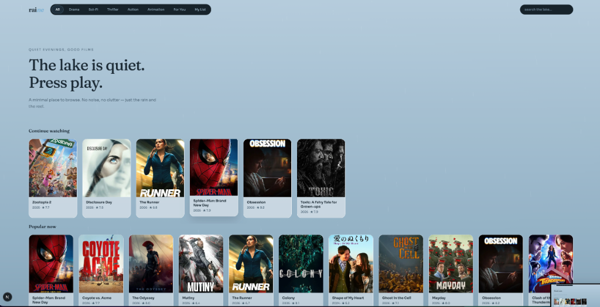
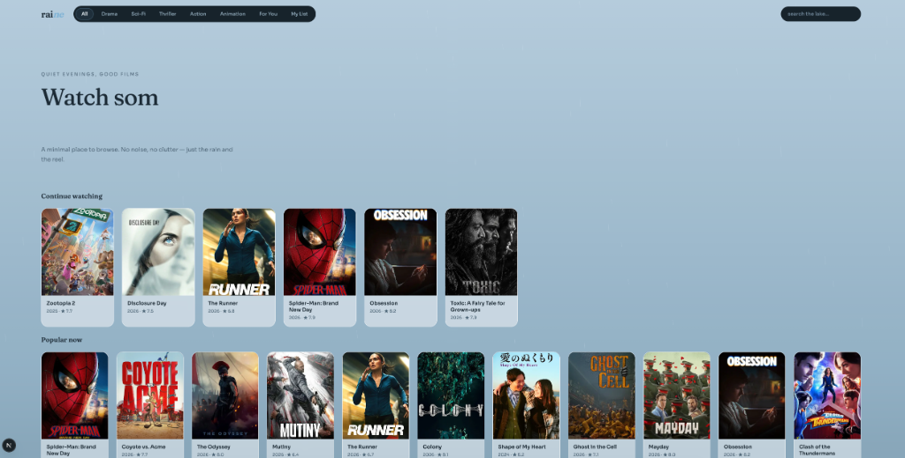
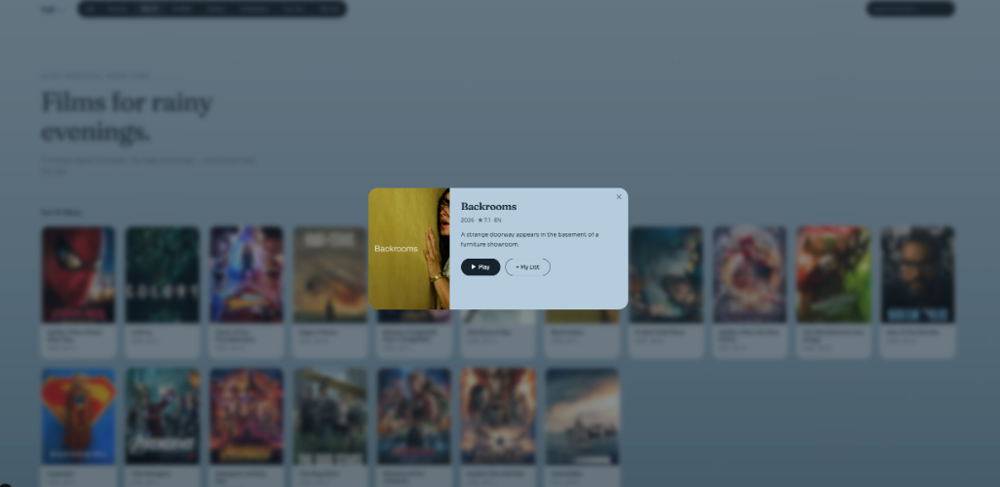

# RAINE

> A minimal, rainy-lake movie browser. Watch calmly.

## Tech Stack
- Next.js 14 (App Router)
- TMDB API (catalog & metadata)
- Vidy Embed (video playback)
- Fraunces + Sora (typography)

## Features
- Browse popular movies by genre
- Search the TMDB catalog
- Save films to My List
- Continue Watching with resume progress
- Watch movies via Vidy embed player
- Responsive glassmorphism UI

## Screenshots

<div style="display: flex; gap: 10px; margin-bottom: 20px;">
  
  
  
</div>

## Getting Started

```bash
git clone https://github.com/ruzzhdontmiss/raine.git
cd raine
npm install
npm run dev
```
